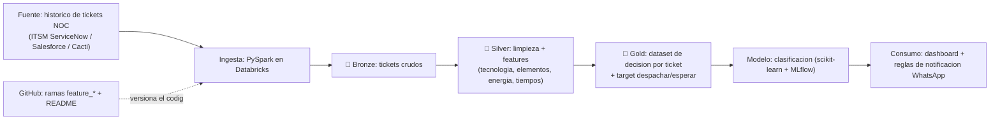

# 📡 Agentes de Ingesta — Operación de Red (NOC) · Proyecto Final Big Data

> Proyecto final del curso de Big Data (UNAULA, 2026). Pipeline de datos sobre el **histórico de tickets** de un **NOC (Network Operations Center)** para **clasificar incidencias de red**, consultar **soluciones anteriores** sobre el elemento afectado y **recomendar si despachar o no una cuadrilla**.
>
> 📖 Documentación del curso y resúmenes de clase: [`Entrega_BIGDATA`](https://github.com/juliomario11/Entrega_BIGDATA).
>
> 👤 **Autor:** Mario Daniel Enrique Perez Jimenez

---

## 🎯 Problema de negocio

En el **NOC**, cuando se reporta una falla, el operador debe decidir rápidamente si **despachar una cuadrilla** al sitio o **esperar**, porque una parte de las incidencias se **restablece de forma autónoma** (p. ej. cuando la causa raíz es un corte de **energía eléctrica comercial** en el sector y el servicio vuelve solo al normalizarse la red eléctrica).

Despachar a una falla que se iba a auto-resolver implica **costo operativo y desplazamientos innecesarios**. No despachar ante una falla real implica **indisponibilidad** y afectación al cliente y a los SLA.

## 🛰️ Dominio de red

Un mismo ticket puede agrupar varios elementos según la tecnología:

- **HFC**: `CMTS → INTERFAZ → NODO`. Algunos nodos cuelgan de un mismo **cable padre**, otros de un **cable hijo** o son independientes. Los nodos HFC tienen **fuentes de respaldo** (baterías de corta duración) que reportan por un **endpoint** su **voltaje** y **amperaje**, lo que permite saber si el nodo está **consumiendo batería** (sin red comercial) o **pegado a la red eléctrica**.
- **GPON**: `OLT → INTERFAZ → ARPON`.

Esta señal de energía (voltaje/amperaje de la fuente de respaldo) es clave: si varios nodos de un mismo sector están en batería, lo más probable es una **falla eléctrica externa** → candidato a **autorrestablecimiento**.

## ✅ Objetivo

Dado un ticket nuevo, el sistema:

1. **Clasifica** la incidencia (tecnología, elementos afectados, sector, impacto/urgencia).
2. **Recupera soluciones anteriores** sobre los mismos elementos o patrones.
3. **Recomienda una acción**: `DESPACHAR_CUADRILLA` o `ESPERAR_AUTORRESTABLECIMIENTO`, con score y justificación.
4. **Notifica** a los grupos de WhatsApp según reglas (VIP, clientes afectados > 2000, impacto/urgencia altos).

---

## 🏗️ Arquitectura (Medallion)



Detalle en [`docs/arquitectura.md`](./docs/arquitectura.md).

---

## 🗂️ Estructura del repositorio

```
agentes_ingesta/
├── notebooks/          # notebooks Databricks del pipeline (se iran agregando)
├── src/                # funciones reutilizables (generador de datos, limpieza, reglas)
├── docs/
│   ├── caso_de_negocio.md
│   ├── arquitectura.md
│   └── diccionario_datos.md
├── data/               # SOLO muestras pequenas y simuladas (datos reales NO se versionan)
├── .gitignore
├── requirements.txt
└── README.md
```

> ⚠️ No se versionan datos reales. La data de trabajo es **simulada** (ver `src/` y `docs/diccionario_datos.md`).

## ▶️ Generar la data simulada

```bash
python -m venv .venv && source .venv/bin/activate
pip install -r requirements.txt
python src/generar_datos.py            # 1000 tickets -> data/sample_tickets.csv
python src/generar_datos.py --n 5000   # opcional: mas volumen
```

El script imprime la distribución del target, los tickets por región y cuántos requieren notificación a WhatsApp. En `data/sample_tickets.csv` queda una **muestra versionada** para inspección rápida.

---

## 📋 Estado de los componentes (proyecto final)

| # | Componente | Estado |
|---|---|---|
| 1 | Caso de negocio | 🟢 [`docs/caso_de_negocio.md`](./docs/caso_de_negocio.md) |
| 2 | Análisis beneficio–costo | 🟢 [`docs/beneficio_costo.md`](./docs/beneficio_costo.md) |
| 3 | Arquitectura propuesta | 🟢 [`docs/arquitectura.md`](./docs/arquitectura.md) |
| 4 | Generador de datos simulados | ✅ [`src/generar_datos.py`](./src/generar_datos.py) |
| 5 | Pipeline Medallion (bronze→silver→gold) | ✅ [`notebooks/`](./notebooks/) · [`sql/`](./sql/) |
| 6 | Modelo de decisión (despachar / esperar) | ✅ [`notebooks/04_modelo.py`](./notebooks/04_modelo.py) |
| 7 | Visualizaciones / dashboard + reglas de notificación | ✅ [`notebooks/05_dashboard.py`](./notebooks/05_dashboard.py) · [`06_notificaciones_whatsapp.py`](./notebooks/06_notificaciones_whatsapp.py) |

---

## ⚠️ Reglas de oro

1. **Nunca subas tokens ni credenciales** (PAT, claves de Databricks, ServiceNow/Salesforce). Si alguno se filtra, revócalo.
2. **No trabajes directo sobre `main`** — usa ramas `feature_*`.
3. **El repo es para código, no para datos.** Datos reales fuera del repo; solo muestras simuladas.
4. Nombres **sin eñes, tildes, mayúsculas ni espacios**.
5. **Anonimiza** cualquier dato sensible (clientes, técnicos, grupos de WhatsApp).

---

**Autor:** Mario Daniel Enrique Perez Jimenez

*Proyecto final — Especialización en Analítica de Datos, UNAULA 2026.*
