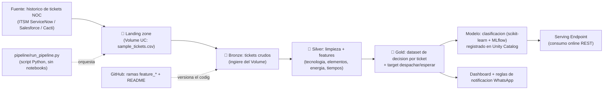

# 📡 Agentes de Ingesta — Operación de Red (NOC) · Proyecto Final Big Data

> Proyecto final del curso de Big Data (UNAULA, 2026). Pipeline de datos sobre el **histórico de tickets** de un **NOC (Network Operations Center)** para **clasificar incidencias de red**, consultar **soluciones anteriores** sobre el elemento afectado y **recomendar si despachar o no una cuadrilla**.
>
> 📖 Documentación del curso y resúmenes de clase: [`Entrega_BIGDATA`](https://github.com/juliomario11/Entrega_BIGDATA).
>
> 👤 **Autor:** Mario Daniel Enrique Perez Jimenez

---

## 🎯 Problema de negocio

En el **NOC**, cuando se reporta una falla, el operador debe decidir rápidamente si **despachar una cuadrilla** al sitio o **esperar**, porque una parte de las incidencias se **restablece de forma autónoma** (p. ej. cuando la causa raíz es un corte de **energía eléctrica comercial** en el sector y el servicio vuelve solo al normalizarse la red eléctrica).

Despachar a una falla que se iba a auto-resolver implica **costo operativo y desplazamientos innecesarios**. No despachar ante una falla real implica **indisponibilidad** y afectación al cliente y a los SLA.

## 🛰️ Dominio de red

Un mismo ticket puede agrupar varios elementos según la tecnología:

- **HFC**: `CMTS → INTERFAZ → NODO`. Algunos nodos cuelgan de un mismo **cable padre**, otros de un **cable hijo** o son independientes. Los nodos HFC tienen **fuentes de respaldo** (baterías de corta duración) que reportan por un **endpoint** su **voltaje** y **amperaje**, lo que permite saber si el nodo está **consumiendo batería** (sin red comercial) o **pegado a la red eléctrica**.
- **GPON**: `OLT → INTERFAZ → ARPON`.

Esta señal de energía (voltaje/amperaje de la fuente de respaldo) es clave: si varios nodos de un mismo sector están en batería, lo más probable es una **falla eléctrica externa** → candidato a **autorrestablecimiento**.

## ✅ Objetivo

Dado un ticket nuevo, el sistema:

1. **Clasifica** la incidencia (tecnología, elementos afectados, sector, impacto/urgencia).
2. **Recupera soluciones anteriores** sobre los mismos elementos o patrones.
3. **Recomienda una acción**: `DESPACHAR_CUADRILLA` o `ESPERAR_AUTORRESTABLECIMIENTO`, con score y justificación.
4. **Notifica** a los grupos de WhatsApp según reglas (VIP, clientes afectados > 2000, impacto/urgencia altos).

---

## 🏗️ Arquitectura (Medallion)



Detalle en [`docs/arquitectura.md`](./docs/arquitectura.md).

---

## 📈 Análisis descriptivo / EDA

Antes de modelar se realiza un **análisis exploratorio (EDA)** sobre la capa Gold (`workspace.gold.decision_cuadrilla`, n = 1.500). Detalle completo con cifras en [`docs/analisis_descriptivo.md`](./docs/analisis_descriptivo.md).

- **Calidad:** 1.500 filas, **0 nulos**, **0 tickets duplicados**; las 1.500 filas pasan los filtros de Silver.
- **Desbalance del target (clave para el modelado):** `DESPACHAR_CUADRILLA` **82,7 %** · `ESPERAR_AUTORRESTABLECIMIENTO` **10,7 %** · `TECNICO_URGENTE` **6,6 %** → ratio **≈ 12,5 : 1**. Por eso se prioriza **recall/F1 por clase** y `class_weight="balanced"` (la *accuracy* es engañosa).
- **Hallazgo bivariado:** `ESPERAR_AUTORRESTABLECIMIENTO` **no ocurre nunca en GPON** (la batería de respaldo solo existe en HFC).
- **Target determinista:** `P(TECNICO_URGENTE | falla_simultanea) = 100 %` y `P(ESPERAR | batería ∧ nodos≥2 ∧ correlación) = 100 %` → conviene **evitar fuga** de `forma_resolucion` / `restablecio_autonomo` como *features*.

Se genera con:

```bash
python src/analisis_descriptivo.py     # local: estadísticos + 7 figuras en docs/img/eda/
```

…o ejecutando el notebook [`notebooks/07_eda_analisis_descriptivo.py`](./notebooks/07_eda_analisis_descriptivo.py) sobre las tablas vivas de Databricks. Las 7 figuras (distribución del target, histogramas, categóricas, target por grupo, boxplots, correlación y *drivers*) quedan **versionadas en SVG** en `docs/img/eda/` y **embebidas** en el reporte.

---

## 🤖 Modelo propuesto

Clasificador multiclase que, a partir de la capa Gold (`workspace.gold.decision_cuadrilla`), predice la **acción recomendada** ante un ticket: `DESPACHAR_CUADRILLA`, `ESPERAR_AUTORRESTABLECIMIENTO` o `TECNICO_URGENTE`. Implementado en [`notebooks/04_modelo.py`](./notebooks/04_modelo.py).

- **Algoritmo:** `RandomForestClassifier` (`n_estimators=300`, `max_depth=12`, `class_weight="balanced"` para compensar que `DESPACHAR_CUADRILLA` domina), dentro de un `Pipeline` de scikit-learn.
- **Preprocesamiento (`ColumnTransformer`):** `StandardScaler` para las numéricas, `OneHotEncoder` para las categóricas y *passthrough* para las booleanas.
- **Variables de entrada (22):** 11 numéricas (elementos afectados, clientes afectados, voltaje/amperaje de la fuente, nodos del sector en batería, % de autorrestablecimiento del sector, tiempos, etc.), 5 categóricas (región, tecnología, impacto, urgencia, fuente de monitoreo) y 6 booleanas (VIP, en batería, correlación de monitoreo, falla simultánea NODO/ARPON, etc.).
- **Métrica priorizada:** **recall de `DESPACHAR_CUADRILLA`** — no dejar fallas reales sin atender pesa más que un despacho innecesario. Se reportan además `accuracy` y `f1_macro`.
- **Tracking y registro:** **MLflow** (métricas por corrida) y registro en **Unity Catalog** como `workspace.gold.modelo_decision_cuadrilla`.

> ⚠️ **Nota metodológica:** el `target` se deriva de reglas determinísticas sobre estas mismas señales (daño multielemento; energía en batería + correlación de monitoreo), por lo que el modelo aprende la regla casi perfectamente y las métricas resultan muy altas. Es lo esperado con datos **simulados**; con datos reales las etiquetas tendrían ruido y el modelo aportaría mayor valor predictivo.

---

## 🚀 Serving Endpoint (consumo del modelo)

El modelo registrado en Unity Catalog se despliega como **Databricks Model Serving** para consumir la recomendación en línea (REST), sin abrir un notebook:

```bash
pip install databricks-sdk
export DATABRICKS_HOST="https://dbc-xxxx.cloud.databricks.com"
export DATABRICKS_TOKEN="****"
python serving/deploy_serving_endpoint.py        # despliega la última versión del modelo
```

Con el endpoint activo, se consume así:

```bash
curl -s -X POST \
  "$DATABRICKS_HOST/serving-endpoints/noc-decision-cuadrilla/invocations" \
  -H "Authorization: Bearer $DATABRICKS_TOKEN" \
  -H "Content-Type: application/json" \
  -d '{"dataframe_records": [{"region": "ANDINA", "tecnologia": "HFC", "...": "..."}]}'
```

Script: [`serving/deploy_serving_endpoint.py`](./serving/deploy_serving_endpoint.py).

---

## 🗂️ Estructura del repositorio

```
agentes_ingesta/
├── pipeline/           # orquestador del pipeline en Python (run_pipeline.py) - sin notebooks
├── notebooks/          # notebooks Databricks (01_bronze ... 06_notificaciones, 07_eda)
├── sql/                # pipeline Medallion en SQL (bronze<-Volume, silver, gold) + dashboard
├── serving/            # despliegue del modelo como Serving Endpoint
├── src/                # funciones reutilizables (generar_datos.py, analisis_descriptivo.py)
├── docs/
│   ├── caso_de_negocio.md
│   ├── beneficio_costo.md
│   ├── arquitectura.md
│   ├── analisis_descriptivo.md   # EDA (componente #5)
│   ├── diccionario_datos.md
│   └── img/eda/                  # figuras del EDA en SVG (versionadas)
├── data/               # muestra simulada versionada (sample_tickets.csv); datos reales NO se versionan
├── PENDIENTES.md       # checklist de cierre del proyecto (multi-sesion)
├── .gitignore
├── requirements.txt
└── README.md
```

> ⚠️ No se versionan datos reales. La data de trabajo es **simulada** (ver `src/` y `docs/diccionario_datos.md`).

## ▶️ Generar la data simulada

```bash
python -m venv .venv && source .venv/bin/activate
pip install -r requirements.txt
python src/generar_datos.py            # 1000 tickets -> data/sample_tickets.csv
python src/generar_datos.py --n 5000   # opcional: mas volumen
```

El script imprime la distribución del target, los tickets por región y cuántos requieren notificación a WhatsApp. En `data/sample_tickets.csv` queda una **muestra versionada** para inspección rápida.

---

## ⚙️ Pipeline automatizado (script de Python, sin notebooks)

Todo el flujo de ingesta se ejecuta con **un solo script de Python** — no hace falta correr notebooks. El script genera la data, la deja en el **Volume (landing zone)** y ejecuta el Medallion `bronze → silver → gold` en el SQL Warehouse:

```bash
pip install -r requirements.txt
export DATABRICKS_HOST="https://dbc-xxxx.cloud.databricks.com"
export DATABRICKS_TOKEN="****"
export DATABRICKS_WAREHOUSE_ID="xxxxxxxxxxxx"     # SQL Warehouse (Serverless)
python pipeline/run_pipeline.py                   # 1500 tickets por defecto
python pipeline/run_pipeline.py --n 5000          # opcional: más volumen
```

Flujo: `generar_datos.py → CSV → /Volumes/workspace/bronze/landing_zone/ → bronze (lee del Volume) → silver → gold`. La capa **Bronze ahora ingiere el CSV crudo desde el Volume** ([`sql/01_bronze.sql`](./sql/01_bronze.sql)), alineando la implementación con la arquitectura (landing zone → bronze). La variante 100 % SQL que genera los datos sin Volume sigue disponible en [`sql/pipeline_noc_medallion.sql`](./sql/pipeline_noc_medallion.sql).

Script: [`pipeline/run_pipeline.py`](./pipeline/run_pipeline.py).

---

## 📋 Estado de los componentes (proyecto final)

| # | Componente | Estado |
|---|---|---|
| 1 | Caso de negocio | 🟢 [`docs/caso_de_negocio.md`](./docs/caso_de_negocio.md) |
| 2 | Análisis beneficio–costo | 🟢 [`docs/beneficio_costo.md`](./docs/beneficio_costo.md) |
| 3 | Arquitectura propuesta | 🟢 [`docs/arquitectura.md`](./docs/arquitectura.md) |
| 4 | Generador de datos simulados | ✅ [`src/generar_datos.py`](./src/generar_datos.py) |
| 5 | Pipeline Medallion (bronze→silver→gold) + automatización | ✅ [`pipeline/run_pipeline.py`](./pipeline/run_pipeline.py) · [`sql/`](./sql/) · [`notebooks/`](./notebooks/) |
| 6 | Modelo de decisión (despachar / esperar) | ✅ [`notebooks/04_modelo.py`](./notebooks/04_modelo.py) · registrado en Unity Catalog |
| 7 | Análisis descriptivo / EDA | 🟢 [`docs/analisis_descriptivo.md`](./docs/analisis_descriptivo.md) · [`notebooks/07_eda_analisis_descriptivo.py`](./notebooks/07_eda_analisis_descriptivo.py) · [`src/analisis_descriptivo.py`](./src/analisis_descriptivo.py) |
| 8 | Visualizaciones / dashboard + reglas de notificación | ✅ [`notebooks/05_dashboard.py`](./notebooks/05_dashboard.py) · [`06_notificaciones_whatsapp.py`](./notebooks/06_notificaciones_whatsapp.py) |
| 9 | Serving Endpoint (consumo del modelo) | 🟡 script listo: [`serving/deploy_serving_endpoint.py`](./serving/deploy_serving_endpoint.py) — falta desplegar |

> 📌 Checklist de cierre y pasos pendientes para sesiones futuras: [`PENDIENTES.md`](./PENDIENTES.md).

---

## ⚠️ Reglas de oro

1. **Nunca subas tokens ni credenciales** (PAT, claves de Databricks, ServiceNow/Salesforce). Si alguno se filtra, revócalo.
2. **No trabajes directo sobre `main`** — usa ramas `feature_*`.
3. **El repo es para código, no para datos.** Datos reales fuera del repo; solo muestras simuladas.
4. Nombres **sin eñes, tildes, mayúsculas ni espacios**.
5. **Anonimiza** cualquier dato sensible (clientes, técnicos, grupos de WhatsApp).

---

**Autor:** Mario Daniel Enrique Perez Jimenez

*Proyecto final — Especialización en Analítica de Datos, UNAULA 2026.*
