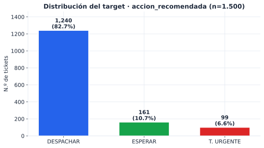
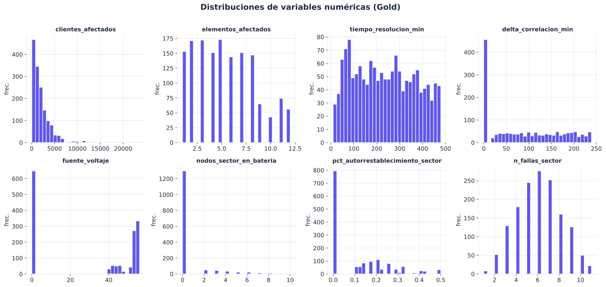
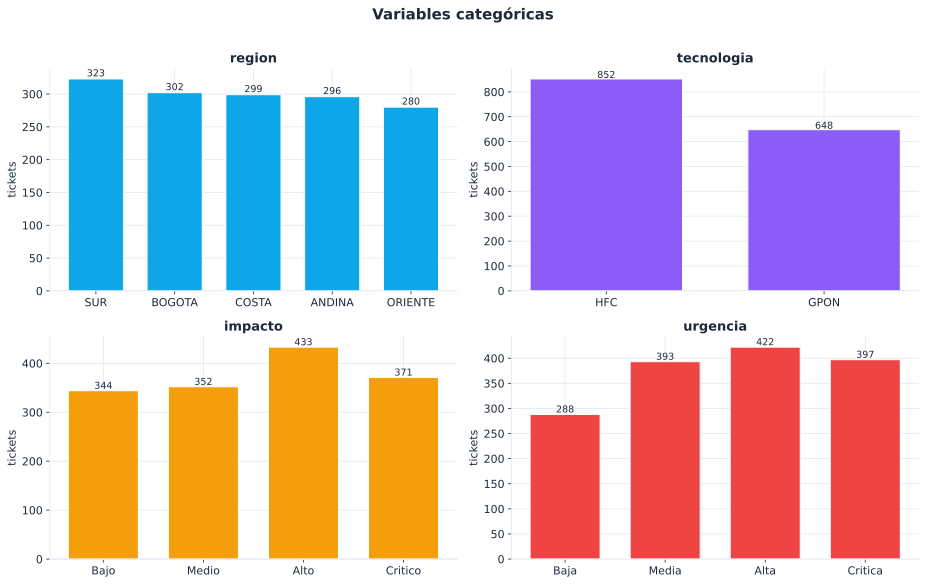
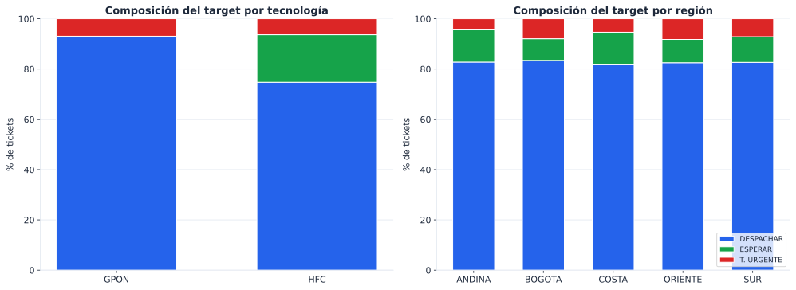
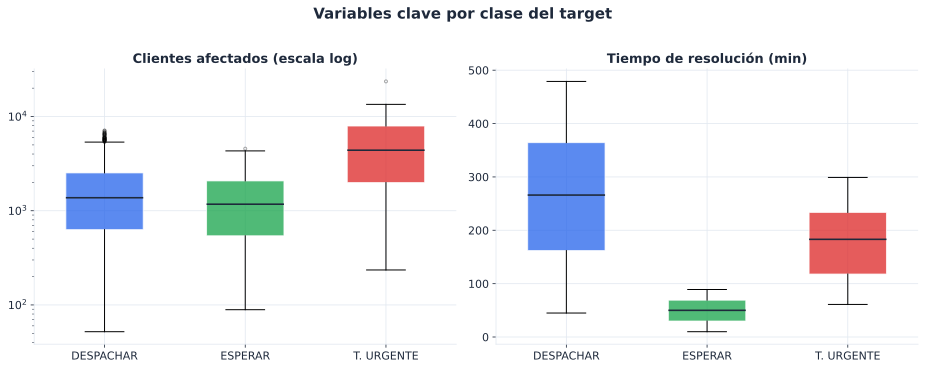
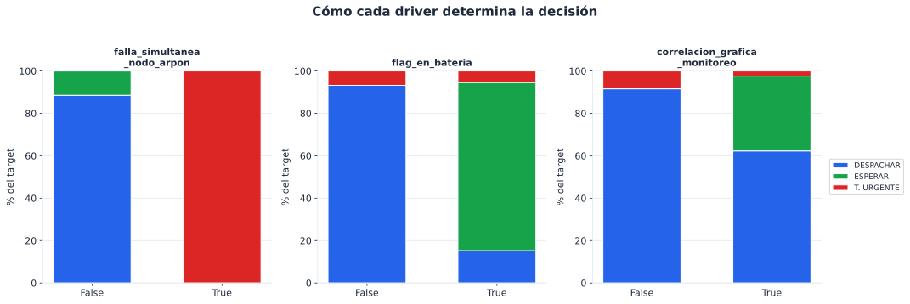
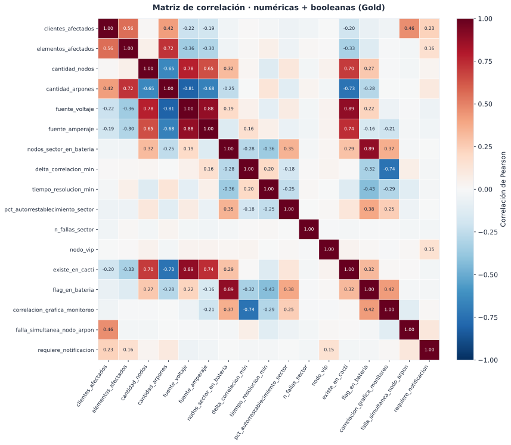

# 📊 Análisis Descriptivo / EDA — Decisión de Cuadrillas (NOC)

> **Componente #5 — Ciencia de datos.** Análisis exploratorio de datos (EDA) sobre la capa
> **Gold** (`workspace.gold.decision_cuadrilla`), **n = 1.500 tickets**.
> El dataset es **simulado y determinista** (`src/generar_datos.py`, semilla `42`) — el mismo
> CSV versionado en [`data/sample_tickets.csv`](../data/sample_tickets.csv) que aterriza en la
> *landing zone* y alimenta Bronze, por lo que el análisis es **100 % reproducible**.
>
> **Autor:** Mario Daniel Enrique Perez Jimenez.

## ▶️ Cómo reproducir

| Entorno | Comando | Salida |
|---|---|---|
| **Local** (sin Databricks) | `python src/analisis_descriptivo.py` | Estadísticos por consola + 7 figuras en `docs/img/eda/` |
| **Databricks** (tablas vivas) | Ejecutar `notebooks/07_eda_analisis_descriptivo.py` | Mismo EDA sobre `silver.tickets_noc` y `gold.decision_cuadrilla` |

> Las figuras se versionan como **SVG vectorial** en `docs/img/eda/` (se regeneran con el
> script/notebook) y van **embebidas** en este documento.

---

## 1. Resumen del dataset

| Métrica | Valor |
|---|---|
| Filas × columnas (Gold) | **1.500 × 27** |
| Valores nulos | **0** |
| Tickets duplicados | **0** |
| Linaje | Bronze (CSV landing zone) → Silver (limpieza + *features*) → Gold (agregados de sector + *target*) |
| Filas que pasan los filtros de Silver | **1.500 / 1.500** (100 %) |

La calidad es perfecta porque la fuente es simulada; aun así, el pipeline aplica las validaciones
reales (no nulos, `tecnologia ∈ {HFC, GPON}`, `hora_restablecimiento ≥ hora_caida`, voltaje/amperaje ≥ 0).

---

## 2. Variable objetivo — `accion_recomendada` (desbalance de clases)

| Clase | Tickets | % |
|---|---:|---:|
| `DESPACHAR_CUADRILLA` | 1.240 | **82,67 %** |
| `ESPERAR_AUTORRESTABLECIMIENTO` | 161 | **10,73 %** |
| `TECNICO_URGENTE` | 99 | **6,60 %** |

**Hallazgo principal: fuerte desbalance de clases (≈ 12,5 : 1** entre la clase mayoritaria y la
minoritaria). Implicaciones para el modelado:

- La *accuracy* es **engañosa**: un clasificador trivial que siempre prediga `DESPACHAR_CUADRILLA`
  acertaría el 82,7 % sin aprender nada.
- Hay que priorizar **recall y F1 por clase**, en especial para `TECNICO_URGENTE` (solo 6,6 %),
  cuyo costo operativo de error es el más alto (no enviar técnico ante una caída masiva).
- Técnicas recomendadas: `class_weight="balanced"`, *oversampling* (SMOTE) o *threshold tuning*.

---

## 3. Análisis univariado — variables numéricas

| Variable | media | std | mín | P25 | mediana | P75 | máx |
|---|---:|---:|---:|---:|---:|---:|---:|
| `clientes_afectados` | 1.997,5 | 1.951,5 | 52 | 663,5 | 1.436 | 2.687 | 23.596 |
| `elementos_afectados` | 5,39 | 3,08 | 1 | 3 | 5 | 8 | 12 |
| `cantidad_nodos` | 2,51 | 2,78 | 0 | 0 | 2 | 5 | 8 |
| `cantidad_arpones` | 2,88 | 4,02 | 0 | 0 | 0 | 6 | 12 |
| `fuente_voltaje` | 29,32 | 25,82 | 0 | 0 | 43,58 | 53,91 | 56 |
| `fuente_amperaje` | 3,02 | 3,19 | 0 | 0 | 1,80 | 6,06 | 9 |
| `nodos_sector_en_bateria` | 0,57 | 1,61 | 0 | 0 | 0 | 0 | 10 |
| `delta_correlacion_min` | 91,09 | 78,68 | 0 | 6 | 80 | 163 | 239 |
| `tiempo_resolucion_min` | 234,5 | 131,2 | 10 | 118,8 | 230 | 345,3 | 479 |
| `pct_autorrestablecimiento_sector` | 0,11 | 0,13 | 0 | 0 | 0 | 0,20 | 0,50 |
| `n_fallas_sector` | 6,01 | 2,09 | 1 | 5 | 6 | 7 | 11 |

**Lecturas clave:**

- **`clientes_afectados` está fuertemente sesgada a la derecha** (media 1.997 ≫ mediana 1.436; máx 23.596).
  La cola larga corresponde a las fallas simultáneas, que multiplican los clientes por 2–4×.
- **`fuente_voltaje` es trimodal por diseño:** `0` en GPON (sin fuente modelada), `~40–47 V` en HFC
  en batería y `~52–56 V` en HFC con energía normal. Esto la vuelve un excelente discriminador de estado.
- **`nodos_sector_en_bateria` es cero-inflada:** la mayoría de tickets vale 0 (solo aplica a HFC en corte
  eléctrico de sector).
- **`n_fallas_sector` ≈ 6** fallas por cable padre — útil para detectar sectores reincidentes.

---

## 4. Análisis univariado — variables categóricas y booleanas

| `region` | tickets | | `tecnologia` | tickets | % |
|---|---:|---|---|---:|---:|
| SUR | 323 | | HFC | 852 | 56,8 % |
| BOGOTA | 302 | | GPON | 648 | 43,2 % |
| COSTA | 299 | | | | |
| ANDINA | 296 | | `fuente_monitoreo` | | |
| ORIENTE | 280 | | CACTI (HFC) | 852 | 56,8 % |
| | | | ZABBIX (GPON) | 648 | 43,2 % |

| `impacto` | tickets | % | | `urgencia` | tickets | % |
|---|---:|---:|---|---|---:|---:|
| Alto | 433 | 28,9 % | | Alta | 422 | 28,1 % |
| Critico | 371 | 24,7 % | | Critica | 397 | 26,5 % |
| Medio | 352 | 23,5 % | | Media | 393 | 26,2 % |
| Bajo | 344 | 22,9 % | | Baja | 288 | 19,2 % |

**Distribución de banderas booleanas (% en `True`):**

| Bandera | % True | Comentario |
|---|---:|---|
| `requiere_notificacion` | **85,4 %** | Muy alto — la regla actual (VIP / >2000 clientes / impacto-urgencia alta) notifica casi todo. **Candidata a revisión** para evitar fatiga de alertas. |
| `correlacion_grafica_monitoreo` | 30,4 % | Indicio de causa eléctrica externa visible en Cacti/Zabbix. |
| `flag_en_bateria` | 13,5 % | Solo HFC en corte eléctrico de sector. |
| `nodo_vip` | 11,7 % | Elementos prioritarios. |
| `falla_simultanea_nodo_arpon` | 6,6 % | Daño grave → técnico urgente. |
| `existe_en_cacti` | 51,3 % | ≈ 90 % de los HFC. |

---

## 5. Análisis bivariado — relación con el *target*

**5.1 Target por tecnología** (hallazgo importante):

| Tecnología | DESPACHAR | ESPERAR | T. URGENTE |
|---|---:|---:|---:|
| HFC (852) | 637 (74,8 %) | **161 (18,9 %)** | 54 (6,3 %) |
| GPON (648) | 603 (93,1 %) | **0 (0 %)** | 45 (6,9 %) |

> **`ESPERAR_AUTORRESTABLECIMIENTO` no ocurre nunca en GPON.** La batería de respaldo solo se modela en
> HFC, así que el autorrestablecimiento por energía es exclusivo de esa tecnología. Es la relación
> bivariada más fuerte del dataset.

**5.2 Variables clave por clase:**

| Clase | `clientes_afectados` (mediana) | `tiempo_resolucion_min` (mediana) |
|---|---:|---:|
| DESPACHAR_CUADRILLA | 1.374 | **266** (la más lenta) |
| ESPERAR_AUTORRESTABLECIMIENTO | 1.173 | **50** (la más rápida) |
| TECNICO_URGENTE | **4.393** (la más alta) | 183 |

`TECNICO_URGENTE` impacta muchísimos más clientes; `ESPERAR` se resuelve solo y rápido.

**5.3 Drivers deterministas del target** (verificación de la regla de negocio):

- `P(TECNICO_URGENTE | falla_simultanea_nodo_arpon = True)` = **100 %**
- `P(ESPERAR | flag_en_bateria ∧ nodos_sector ≥ 2 ∧ correlacion)` = **100 %**

Esto confirma que el *target* es una **regla lógica determinista** sobre tres banderas (ver §8).

---

## 6. Correlaciones

Correlaciones de Pearson más relevantes:

| Par de variables | r | Interpretación |
|---|---:|---|
| `clientes_afectados` ↔ `falla_simultanea` | **+0,46** | Las fallas graves multiplican los clientes afectados. |
| `tiempo_resolucion_min` ↔ `falla_simultanea` | −0,11 | Débil. |
| `tiempo_resolucion_min` ↔ `correlacion_grafica` | −0,11 | Casos con correlación (autorrestablecimiento) se resuelven más rápido. |
| `clientes_afectados` ↔ `elementos_afectados` | +0,34 | Más elementos, más clientes. |

> Las correlaciones lineales con el *target* son **débiles a propósito**: la decisión depende de
> **combinaciones booleanas** (lógica AND/OR), no de relaciones lineales. Por eso un modelo de
> **árbol** (RandomForest) es la elección adecuada y un modelo lineal sería inferior.

---

## 7. Calidad de datos

- ✅ **0 nulos** en las 27 columnas de Gold.
- ✅ **0 tickets duplicados** (1.500 IDs únicos).
- ✅ **Consistencia HFC/GPON:** `cmts`/`cantidad_nodos`/`CACTI` solo en HFC; `olt`/`cantidad_arpones`/`ZABBIX` solo en GPON.
- ✅ **Rangos válidos:** voltaje 0–56 V, tiempos 10–479 min, `hora_restablecimiento ≥ hora_caida` en el 100 % de las filas.
- ✅ `flag_en_bateria` recomputada en Silver (`HFC ∧ 0 < voltaje < 50`) coincide con la bandera de origen.

---

## 8. Conclusiones para el modelado (componente #6)

1. **Riesgo de fuga de información (*data leakage*):** el *target* se deriva de `forma_resolucion` /
   `restablecio_autonomo`; estas columnas **no deben usarse como features**. Tampoco la regla cruda
   directa, salvo para validar.
2. **Desbalance 12,5 : 1** → usar `class_weight="balanced"` y reportar **recall/F1 por clase**
   (priorizar `TECNICO_URGENTE` y `ESPERAR`), no solo *accuracy*.
3. **`ESPERAR` es exclusivo de HFC** → la tecnología y las señales de energía (`fuente_voltaje`,
   `flag_en_bateria`, `nodos_sector_en_bateria`) son features de primer orden.
4. **Features más informativas:** `falla_simultanea_nodo_arpon`, `flag_en_bateria`,
   `correlacion_grafica_monitoreo`, `nodos_sector_en_bateria`, `fuente_voltaje`.
5. **Variables de negocio (no de target):** `region` y `clientes_afectados` aportan poco al *target*
   pero son clave para **priorización y SLA** (a quién atender primero).
6. Como el *target* es determinista sobre datos simulados, las métricas del modelo serán muy altas
   (esperado). En producción, las etiquetas reales tendrían ruido.

---

## 📎 Índice de figuras

| # | Archivo | Contenido |
|---|---|---|
| 1 | `img/eda/01_target_distribucion.svg` | Distribución del *target* y desbalance de clases |
| 2 | `img/eda/02_histogramas_numericas.svg` | Histogramas de 8 variables numéricas |
| 3 | `img/eda/03_categoricas.svg` | Conteos de `region`, `tecnologia`, `impacto`, `urgencia` |
| 4 | `img/eda/04_target_por_grupo.svg` | Composición del *target* por tecnología y por región |
| 5 | `img/eda/05_boxplots_por_target.svg` | `clientes_afectados` y `tiempo_resolucion_min` por clase |
| 6 | `img/eda/06_correlacion.svg` | Matriz de correlación (numéricas + booleanas) |
| 7 | `img/eda/07_drivers_target.svg` | Cómo cada *driver* booleano determina la decisión |

*Generado para el proyecto final de Big Data (UNAULA). Datos 100 % simulados; sin datos reales ni credenciales.*
