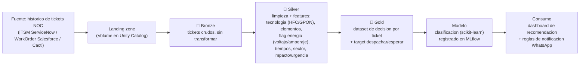

# Arquitectura — Pipeline Medallion en Databricks (NOC)

El proyecto sigue la **arquitectura Medallion** (Bronze → Silver → Gold) sobre **Unity Catalog**, con foco en el **linaje de datos** (pesa ~50% de la nota).

## Capas

### 🥉 Bronze — datos crudos
- Ingesta del export de tickets **tal cual**, sin transformaciones.
- Tabla Delta en `workspace.bronze.tickets_noc`.
- Objetivo: trazabilidad total del dato de origen (ServiceNow, Salesforce, Cacti).

### 🥈 Silver — datos limpios + features
- Tipado de fechas, normalización de texto.
- Derivar:
  - `tecnologia` (HFC / GPON) y conteos `cantidad_nodos`, `cantidad_arpones`.
  - `flag_en_bateria`: el nodo HFC consume batería (voltaje/amperaje de la fuente de respaldo) → indicio de falla eléctrica externa.
  - `nodos_sector_en_bateria`: cuántos nodos del mismo sector/cable padre están en batería (correlación de causa eléctrica).
  - `tiempo_resolucion`, `sector`, `impacto`, `urgencia`, `nodo_vip`.
  - `existe_en_cacti` (monitoreo).
- **Data quality expectations** (nulos críticos, fechas coherentes, tiempos ≥ 0, voltaje/amperaje ≥ 0).
- Tabla `workspace.silver.tickets_noc`.

### 🥇 Gold — dataset de decisión
- Un registro por ticket con las features finales y el **target** `accion_recomendada`.
- Agregados por elemento (n.º de fallas históricas, % autorrestablecimiento por nodo/sector).
- Tabla `workspace.gold.decision_cuadrilla`.

## Modelo
- Clasificación binaria: `DESPACHAR_CUADRILLA` vs `ESPERAR_AUTORRESTABLECIMIENTO`.
- `scikit-learn` (pipeline con encoders) + registro en **MLflow** (params, métricas, modelo con signature en Unity Catalog).
- Métricas: priorizar **recall** de `DESPACHAR_CUADRILLA` (no dejar fallas reales sin atender); reportar precision, F1 y matriz de confusión.

## Consumo y notificaciones
- Dashboard (Databricks / Streamlit): dado un ticket/elemento, muestra la **recomendación**, el **score** y el **historial de soluciones**.
- **Reglas de notificación WhatsApp**: VIP, clientes afectados > 2000, impacto/urgencia altos.

## Linaje
- Todo el flujo queda trazado en **Unity Catalog** (bronze → silver → gold → modelo), criterio de mayor peso en la evaluación.
